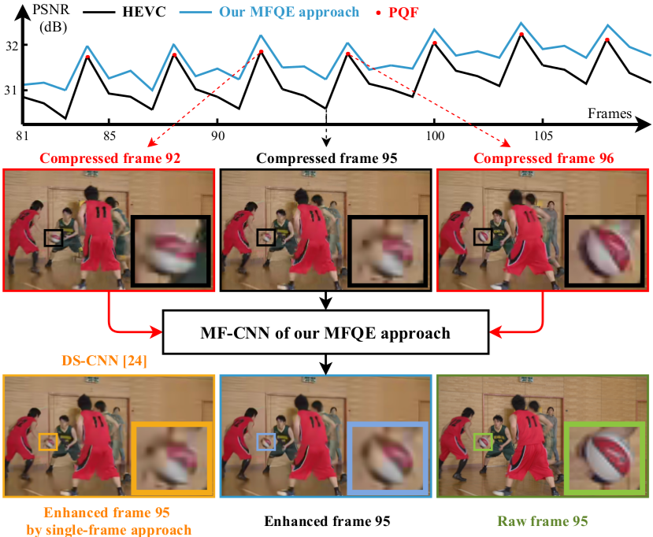
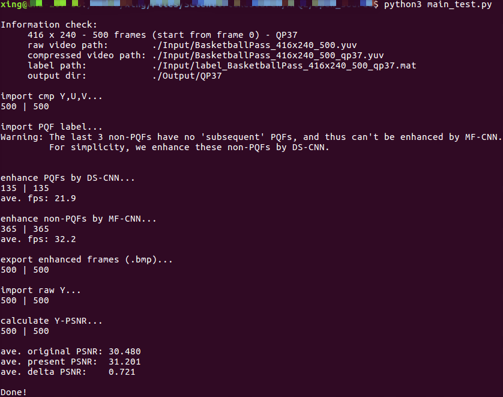

# MFQE 2.0 Demo

***MFQE 2.0: A New Approach for Multi-frame Quality Enhancement on Compressed Video***

*arxiv: later on*

**Note: This repository is available at Dropbox https://www.dropbox.com/sh/s9f9h7kdmetztz9/AAAz6Z1nEovKIqgDsXo34qFia?dl=0.**



# Test Environment

+ Intel i7-8700 CPU, GeForce GTX 1080Ti
+ Ubuntu 16.04 LTS
+ Python 3.5.2
+ TensorFlow 1.8.0
+ TFLearn, Numpy, SciPy, cv2, skimage

# Get Started!

## 1. Preparation

### Raw and compressed yuv video

First, we prepare a **compressed video** (HM16.5-LDP-QP37) `BasketballPass_416x240_500_qp37.yuv` and its **raw video** `BasketballPass_416x240_500.yuv` for this demo.
We can extract these two video from `cmp00+cmp01` and `raw00+raw01` in dir `./Input/`:

```
cat cmp*>BasketballPass_416x240_500_qp37.tar.gz
tar xzvf BasketballPass_416x240_500_qp37.tar.gz
rm BasketballPass_416x240_500_qp37.tar.gz cmp00 cmp01

cat raw*>BasketballPass_416x240_500.tar.gz
tar xzvf BasketballPass_416x240_500.tar.gz
rm BasketballPass_416x240_500.tar.gz raw00 raw01
```

> Raw video is prepared for calculating Y-PSNR.
You can comment this part at the bottom of `main_test.py`, such that raw video and its path are not required anymore.

> Hint: You can go to our Dropbox link and get the unzip videos in dir `./Input/`.

### PQF label

Second, we prepare the **PQF label** `label_BasketballPass_416x240_500_qp37.mat` of `BasketballPass_416x240_500_qp37.yuv`.
This PQF label is generated according to the PSNR curve.

In practical use, we have no PSNR curve for PQF detection.
In this case, you can generate the PQF label by an BiLSTM network.
For more detail, please refer to our paper.

> The format of the PQF label is `.mat` in this demo.
You can change it with other formats (eg., `.txt`, `.npy`).
You need only modify the `### import PQF label` part in `main_test.py`.

## 2. Run

Run `main_test.py` in command line.

## 3. Result



> You can comment the `### export bmp` part in `main_test.py`.

# Note

## 1. Warning

In our MFQE approach, each non-PQF should be enhanced with the help of its neighbouring two PQFs (previous one + subsequent one).
However, the PQF label might be something like ('0' is non-PQF and '1' is PQF):

+ 0 0 1 ... (The first 2 non-PQFs have no 'previous' PQFs)
+ ... 1 0 (The last non-PQF has no 'subsequent' PQF)

In these cases, the labels of these non-PQFs will be changed to '1':

+ 1 1 1 ...
+ ... 1 1

so they can be enhanced by DS-CNN (single-frame quality enhancement approach).

## 2. MF-CNN models

There are two networks in `net_MFCNN.py`, one for QP=22,27,32 and the other for QP=37,42.
The performances of these two networks are close.

